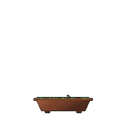

## Hi Vault Tec Calling! 
Hi whoever is reading my profile! My name Ayden and I'm currently a junior computer science student @ Millersville University. My current goals are to:
- Learn all I can about computer science and professional development
- Get a job in the games industry
- Build a game that people cry after playing (odd I know :) ).
  

I have plenty projects keeping me busy! Currently  ![Static Badge](https://img.shields.io/badge/_IAS-Emulator?style=flat&logo=%3Csvg%20role%3D%22img%22%20viewBox%3D%220%200%2024%2024%22%20xmlns%3D%22http%3A%2F%2Fwww.w3.org%2F2000%2Fsvg%22%3E%3Ctitle%3EGitHub%3C%2Ftitle%3E%3Cpath%20d%3D%22M12%20.297c-6.63%200-12%205.373-12%2012%200%205.303%203.438%209.8%208.205%2011.385.6.113.82-.258.82-.577%200-.285-.01-1.04-.015-2.04-3.338.724-4.042-1.61-4.042-1.61C4.422%2018.07%203.633%2017.7%203.633%2017.7c-1.087-.744.084-.729.084-.729%201.205.084%201.838%201.236%201.838%201.236%201.07%201.835%202.809%201.305%203.495.998.108-.776.417-1.305.76-1.605-2.665-.3-5.466-1.332-5.466-5.93%200-1.31.465-2.38%201.235-3.22-.135-.303-.54-1.523.105-3.176%200%200%201.005-.322%203.3%201.23.96-.267%201.98-.399%203-.405%201.02.006%202.04.138%203%20.405%202.28-1.552%203.285-1.23%203.285-1.23.645%201.653.24%202.873.12%203.176.765.84%201.23%201.91%201.23%203.22%200%204.61-2.805%205.625-5.475%205.92.42.36.81%201.096.81%202.22%200%201.606-.015%202.896-.015%203.286%200%20.315.21.69.825.57C20.565%2022.092%2024%2017.592%2024%2012.297c0-6.627-5.373-12-12-12%22%2F%3E%3C%2Fsvg%3E&label=IAS-Emulator) is keeping me busy!

